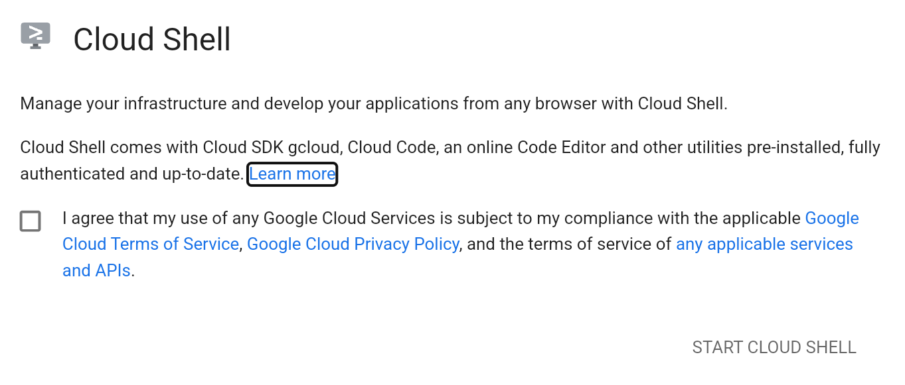
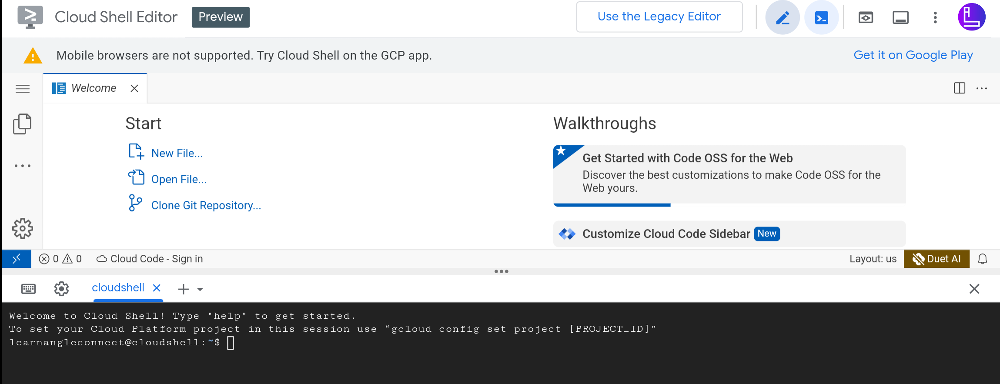

# Google Cloud Shell

## Step 1

- First open [Google cloud shell](https://shell.cloud.google.com/?cloudshell=false&_ga=2.167921249.116761540.1702909987-937838216.1702737321&_gac=1.181699285.1702910031.CjwKCAiA-P-rBhBEEiwAQEXhH2IcBuMtlgVs9A-TSVxHwJ4Cv3bjPIAPELgpf-1cTYRypDmLntroWxoCioEQAvD_BwE&supportedpurview=project&show=ide%2Cterminal), you will get Google Cloud Shell Welocme Screen(if you are opening cloud shell first time)
- Tick the checkbox and click on `Start cloud shell`



*Insure that your google account should already logged in google chrome or any particular browser that you are using.*

## Step 2
After logged in successfully you will get an edior and a cloud shell terminal


*You can minimize the editor by clicking on pencil icon at the top bar*

- update the shell enviornment by executing below command in shell terminal
  ```linux
  sudo apt update
  ```
- Download the remote desktop app by executing below command in shell terminal
    ```linux
    wget https://dl.google.com/linux/direct/chrome-remote-desktop_current_amd64.deb
    ```
 - Install remote desktop, xfce4 for graphical enviornment and wine for installing windows applications(.exe files) by executing below command in shell terminal
 ```linux
sudo apt install ./chrome-remote-desktop_current_amd64.deb -y && sudo DEBIAN_FRONTEND=noninteractive \
    apt install --assume-yes xfce4 desktop-base dbus-x11 xscreensaver -y && sudo bash -c 'echo "exec /etc/X11/Xsession /usr/bin/xfce4-session" > /etc/chrome-remote-desktop-session' && sudo systemctl disable lightdm.service && sudo dpkg --add-architecture i386 && sudo apt-get update &&
sudo apt-get install wine64 wine32 -y
```
