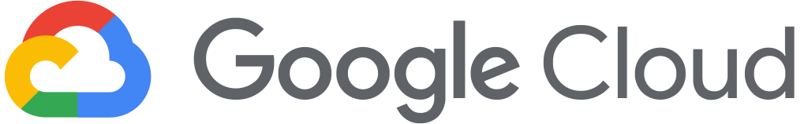
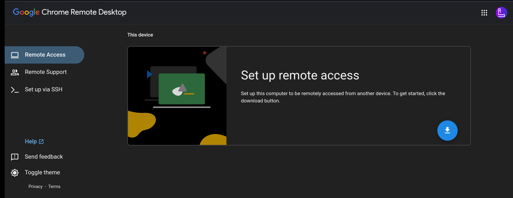
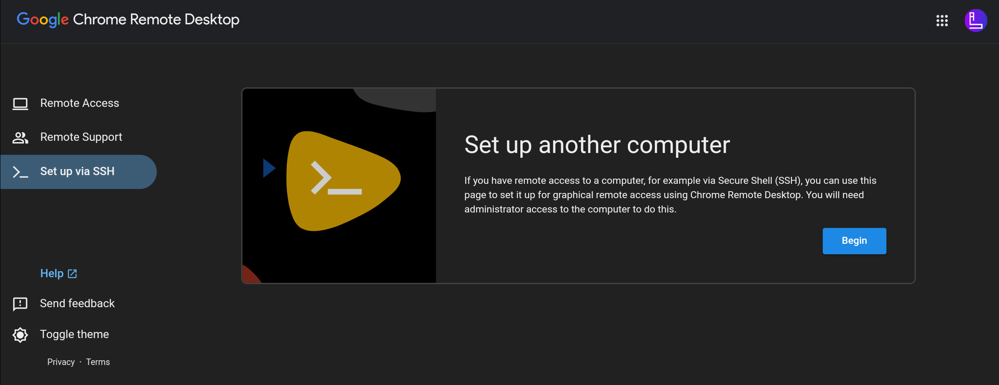
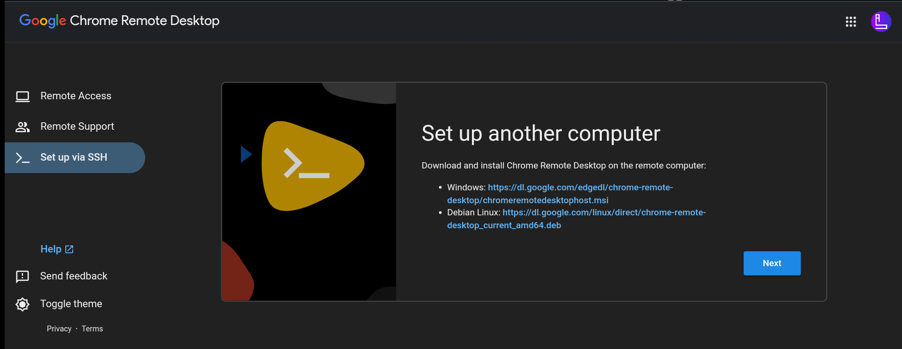
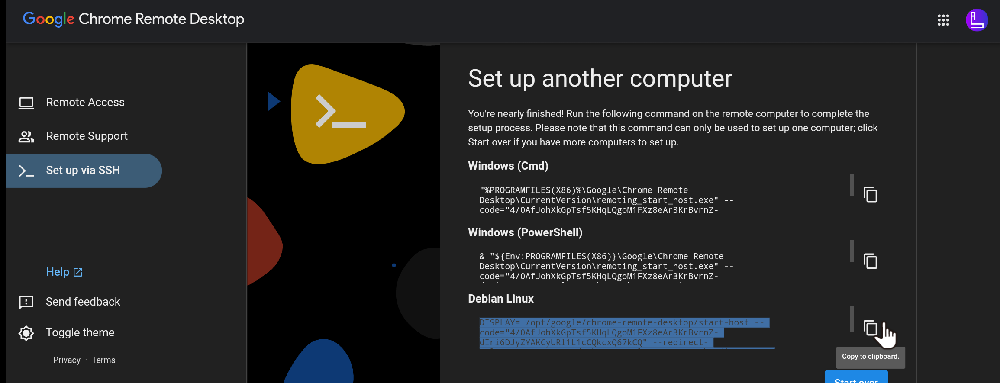
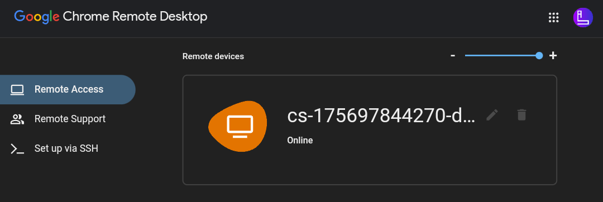
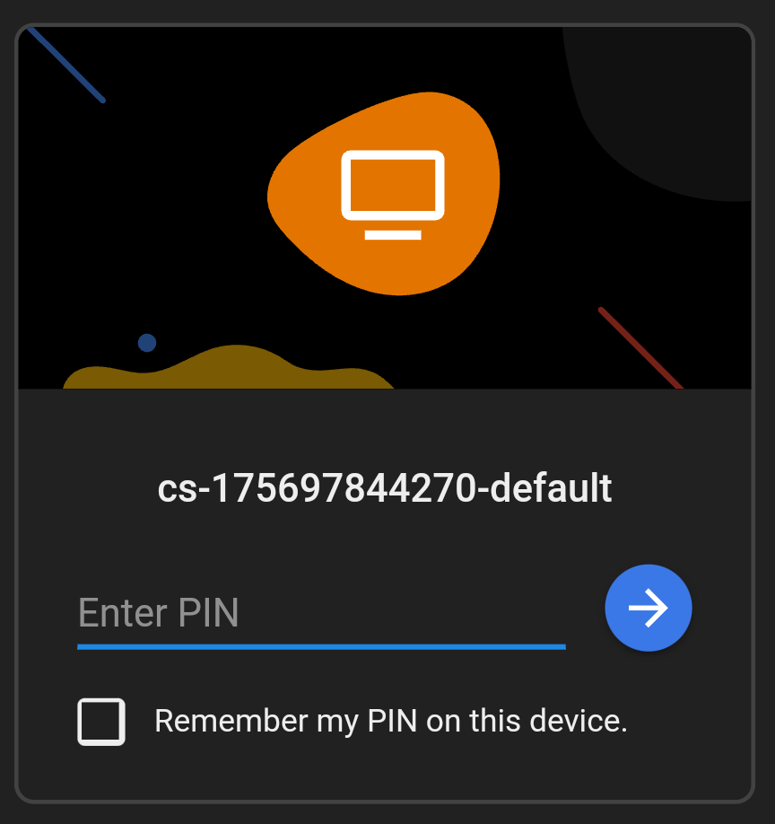
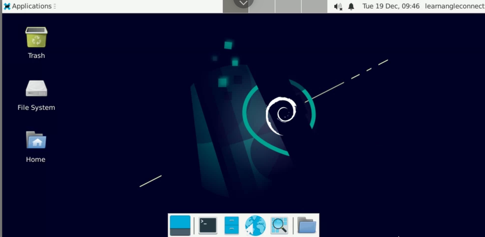

# What is GCS?🤔
Google Cloud Shell is a web-based shell environment provided by Google Cloud Platform (GCP). It allows users to access a command-line interface (CLI) directly from their web browsers, eliminating the need for local installations of development tools or the Google Cloud SDK.✍️

# Setup process of free google cloud shell with Graphical user interface👨‍💻

### Step 1️⃣

- First open
[Google cloud shell](https://shell.cloud.google.com)
- You will get Google Cloud Shell Welocme Screen(if you are opening cloud shell first time)
- Tick the checkbox and click on `Start cloud shell`<br><br>


*Insure that your google account should already logged in google chrome or any particular browser that you are using.*

### Step 2️⃣
After logged in successfully you will get an editor and a cloud shell terminal<br><br>


*You can minimize the editor by clicking on pencil icon at the top bar*

- update the shell enviornment by executing below command in shell terminal
  ```linux
  sudo apt update
  ```
  >The following signatures couldn't be verified because the public key is not available. [Fix update error](updateError.md)
  
- Download the remote desktop app and setup file by executing below command in shell terminal
    ```linux
    wget https://dl.google.com/linux/direct/chrome-remote-desktop_current_amd64.deb https://raw.githubusercontent.com/Himanshhhyou/GCS/main/setup
    ```
- After successful installation run this command
  ```linux
  chmod +x setup && ./setup
  ```

### Step 3️⃣
- Open <a href="https://remotedesktop.google.com/access" target="_blank">Chrome Remote Desktop</a><br><br>


- Click on `Set up via SSH` <br><br>


- Click on `Begin` <br><br>


- Click on `Next` <br><br>


- Click on `Authorize` and copy the Code of `Debian Linux`<br><br>


### Step 4️⃣
- Now click on `Remote Access` and click on your online session<br><br>


- Enter your PIN that you created while connecting with chrome remote desktop<br><br>


## Finally
🙆Enjoy the Cloud based Debian OS with Graphical user interface in your browser<br><br>


