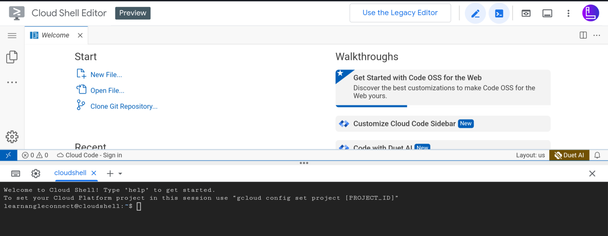

# What is GCS?
Google Cloud Shell is a web-based shell environment provided by Google Cloud Platform (GCP). It allows users to access a command-line interface (CLI) directly from their web browsers, eliminating the need for local installations of development tools or the Google Cloud SDK.

## Step 1

- First open <a href="https://shell.cloud.google.com" target="_blank">Google cloud shell</a>
- You will get Google Cloud Shell Welocme Screen(if you are opening cloud shell first time)
- Tick the checkbox and click on `Start cloud shell`<br><br>


*Insure that your google account should already logged in google chrome or any particular browser that you are using.*

## Step 2
After logged in successfully you will get an edior and a cloud shell terminal<br><br>


*You can minimize the editor by clicking on pencil icon at the top bar*

- update the shell enviornment by executing below command in shell terminal
  ```linux
  sudo apt update
  ```
- Download the remote desktop app by executing below command in shell terminal
    ```linux
    wget https://dl.google.com/linux/direct/chrome-remote-desktop_current_amd64.deb
    ```
 - Install remote desktop, xfce4 for graphical enviornment and wine for installing windows applications(.exe files) by executing below command in shell terminal
 ```linux
sudo apt install ./chrome-remote-desktop_current_amd64.deb -y && sudo DEBIAN_FRONTEND=noninteractive \
    apt install --assume-yes xfce4 desktop-base dbus-x11 xscreensaver -y && sudo bash -c 'echo "exec /etc/X11/Xsession /usr/bin/xfce4-session" > /etc/chrome-remote-desktop-session' && sudo systemctl disable lightdm.service && sudo dpkg --add-architecture i386 && sudo apt-get update &&
sudo apt-get install wine64 wine32 -y
```

## Step 3
- Open <a href="https://remotedesktop.google.com/access" target="_blank">Chrome Remote Desktop</a><br><br>


- Click on `Set up via SSH` <br><br>


- Click on `Begin` <br><br>


- Click on `Next` <br><br>


- Click on `Authorize` and copy the Code of `Debian Linux`<br><br>


## Step 4
- Now click on `Remote Access` and click on your online session<br><br>


- Enter your PIN that you created while connecting with chrome remote desktop<br><br>


## Finally 
Enjoy the Cloud based Debian OS with Graphical user interface <br><br>


